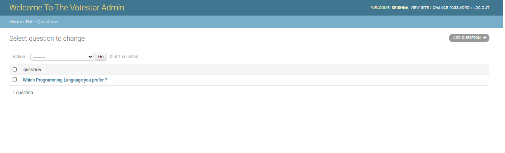
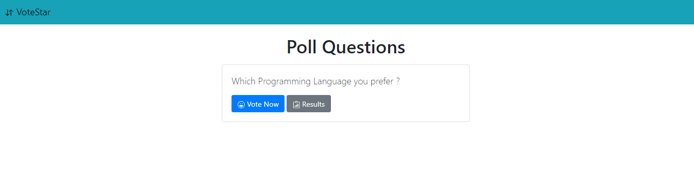
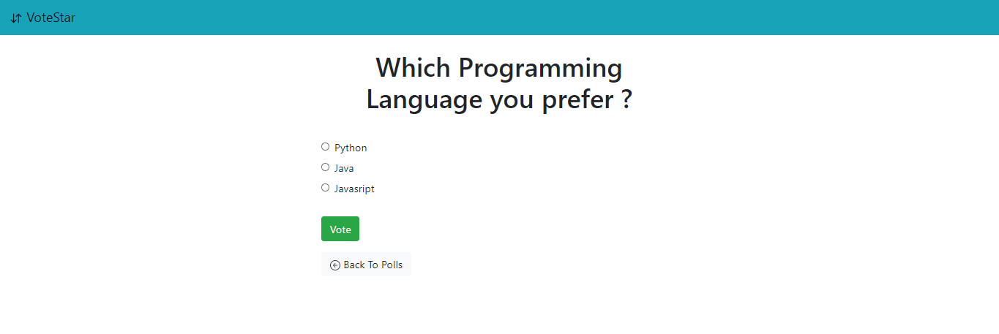
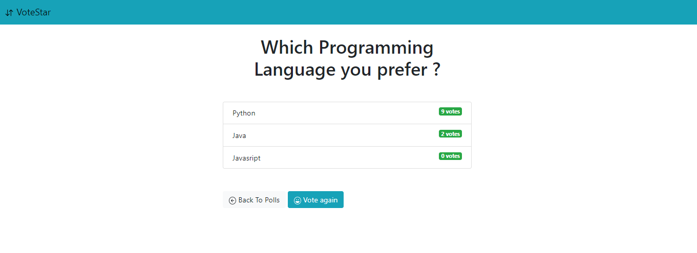

# Django Poll Project

This project covers basic CRUD operation using views, changing django admin template and creating models, views, urls and templates.

## Create Poll through django-admin

Create poll and add options for the poll through django-admin

## Poll App : Contain Vote and Result section

- Vote : To vote for the Poll
- Result : To show all the counts/votes for the poll 

## Screenshots of Project

**Poll Admin** : _To create polls._

**Poll Index** : _To show all the polls._

**Poll Vote** : _To vote for polls._

**Poll Result** : _To show the result of polls._

## Features to add in future

- Graph for better visualization of votes.
- Landing Page
- Image for the poll
- User restriction (one vote per user per poll)
